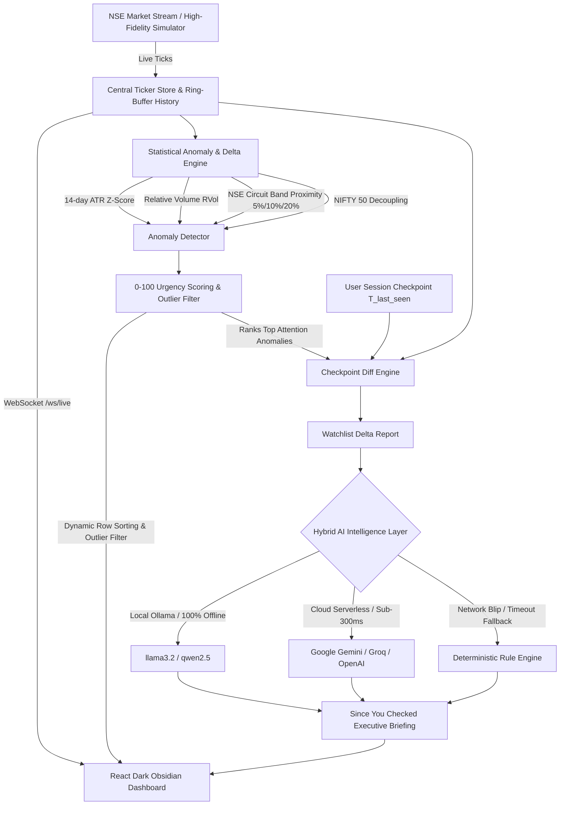

# DHANGURU (धनगुरु)
### Autonomous Market Watchlist & Delta Intelligence Co-Pilot for Indian Equities (NSE/BSE)

> **Built for Groww Hackathon**  
> *Transforming noisy, passive ticker grids into an active, responsible market intelligence co-pilot.*

---

## Executive Summary

Traditional broker watchlists are passive, noisy ticker grids. They flash green and red numbers every second, inducing retail **FOMO** (Fear Of Missing Out), anxiety, and impulsive trading. When retail investors open their trading apps after being away, they have no easy way of knowing:
- *What meaningfully changed while I was away?*
- *Is this sudden +4% move backed by institutional volume or just low-liquidity noise?*
- *Is this stock dangerously close to an upper circuit limit where buying could trap my capital?*

**Dhanguru** solves this by replacing passive ticker observation with **Autonomous Delta Intelligence**. It computes statistical anomalies (14-day ATR volatility bands, Relative Volume surges, NSE circuit limit proximity) between when you last checked and right now, delivering a crisp, human **"Since You Checked" Executive Briefing** powered by local, private AI.

---

## System Architecture



---

## Key Features & Product Highlights

### 1. "Since You Checked" Executive Briefing
- When you open the dashboard after being away (e.g., away for 35m or 3h), Dhanguru compares `T_last_seen` against `T_now`.
- Generates a **crisp 1-sentence macro headline**, assigns market mood (`BULLISH`, `BEARISH`, `VOLATILE`, `CALM`), and provides 2–3 institutional bullet points.
- **FOMO Guard & Capital Protection:** Proactively alerts users if a stock is within 1% of its upper circuit band, advising against chasing illiquid extensions.
- **1-Click Acknowledge:** Mark all caught up in `< 50ms` to reset your session checkpoint.

### 2. Quantitative Anomaly Detection (No Hallucinations)
All quantitative math is computed **100% deterministically in Python** before reaching the LLM:
- **Volatility Breakouts (`Z_vol`):** Measured against rolling 14-day Average True Range (ATR).
- **Relative Volume (`RVol`):** Measured against authentic 20-day time-of-day volume curves.
- **Circuit Limit Warnings:** Live proximity meters for NSE 5%, 10%, and 20% price bands.
- **Composite Urgency Score (0–100):** Weighted multi-factor attention score sorting your watchlist by significance rather than alphabetical order.

### 3. Time-Travel Scrubber
Evaluate deltas across custom time horizons:
- **Since Last Visit** (dynamic checkpoint based on user's actual absence)
- **Past 15m** (intraday impulse detection)
- **Past 1h** (mid-session structural changes)
- **Past 3h** (full-session macro perspective)

### 4. Enterprise-Ready Hybrid AI Layer (DPDP & SEBI Compliant)
Financial applications cannot blindly pipe customer watchlists to external US cloud APIs. Dhanguru supports a multi-tier provider model:
- **Local Ollama (`llama3.2` / `qwen2.5`):** 100% offline, zero API cost, zero customer data leaves the machine (SEBI/DPDP data residency compliant).
- **Cloud APIs (Groq / Gemini / OpenAI):** Optional sub-300ms serverless inference.
- **Deterministic Rule Engine Fallback:** 0ms instantaneous briefing generator guaranteeing **100% financial SLA uptime** even during network outages.

---

## Quickstart Guide

### Prerequisites
- Python 3.11+
- [uv](https://docs.astral.sh/uv/) (recommended) or `pip`
- Node.js 18+ & `npm`
- [Ollama](https://ollama.com/) (Optional, for 100% offline local AI)

### 1. Clone & Configure
```bash
git clone https://github.com/DishaGarg-16/dhanguru.git
cd dhanguru
copy .env.example .env
```

### 2. Start Backend (FastAPI + WebSockets)
```powershell
uv sync
uv run uvicorn backend.app.main:app --reload
```
*Backend runs on `http://127.0.0.1:8000`.*

### 3. Start Frontend (React + Vite)
In a second terminal:
```powershell
cd frontend
npm install
npm run dev
```
*Frontend runs on `http://localhost:5173`.*

---

## Evaluator / Judge Demo Walkthrough

Judges evaluating outside trading hours (9:15 AM – 3:30 PM IST) can test all real-time systems using the built-in **NSE Session Replay Stream**:

1. **Verify AI Briefing:**
   - Look at the **"Since You Checked"** card.
   - Notice the green **`AI Co-Pilot`** badge and macro summary generated by local Ollama (`llama3.2`).
2. **Trigger Simulated Anomalies:**
   - Click the **"Simulate Anomaly"** dropdown in the top header.
   - Click **`Push TRENT to Upper Circuit`** -> Notice the circuit limit meter glow orange/red, the urgency score jump to `90+`, and the Capital Protection Notice appear.
   - Click **`Surge ZOMATO (3.4x volume)`** -> Notice the Relative Volume badge jump to `3.4x RVol` with volume breakout tags.
3. **Time-Travel Scrubbing:**
   - Click **`Past 15m`**, **`Past 1h`**, or **`Past 3h`** on the delta bar to see the briefing dynamically re-evaluate past time windows.
4. **1-Click Checkpoint Acknowledge:**
   - Click **`Acknowledge & Mark All Caught Up`**.
   - Notice the timer instantly reset to `0s` (`All caught up. Monitoring in real time`) in under 50ms.
5. **Manage Watchlist:**
   - Click **`+ Add Stock`** to add any Indian ticker (e.g. `TCS`, `BAJFINANCE`, `SBIN`).

---

## Responsible Investing / FOMO Guard

Groww's core ethos is retail investor empowerment and education. Dhanguru builds this directly into the AI co-pilot:
- **Anti-Chasing Alerts:** When a stock has spiked +5% on low Relative Volume (`< 0.8x`), Dhanguru flags it as *illiquid price extension* rather than a genuine breakout.
- **Circuit Liquidity Warnings:** If a stock is within 0.5% of its upper circuit band, Dhanguru warns the user that liquidity and order execution constraints may trap exit capital.

---

## Tech Stack

| Layer | Technologies |
| :--- | :--- |
| **Backend** | Python 3.12, FastAPI, Uvicorn, WebSockets, Pydantic v2 |
| **Data Engine** | NumPy (rolling ATR & Z-scores), Ring-Buffer History |
| **AI Layer** | Pydantic AI, Local Ollama (`llama3.2` / `qwen2.5`), Cloud Groq / Gemini |
| **Frontend** | React 18, Vite, Obsidian Dark Glassmorphism, Lucide Icons |
| **Styling** | Pure Vanilla CSS Design System (`#0B0E14` obsidian, `#00D09C` emerald) |

---

## License
MIT License. Built for the Groww Hackathon.
